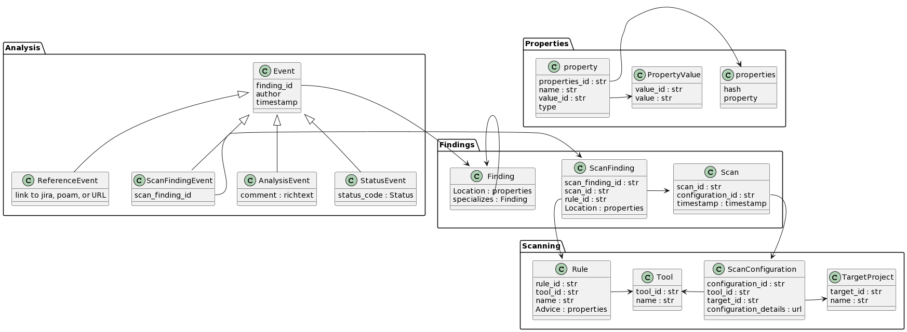
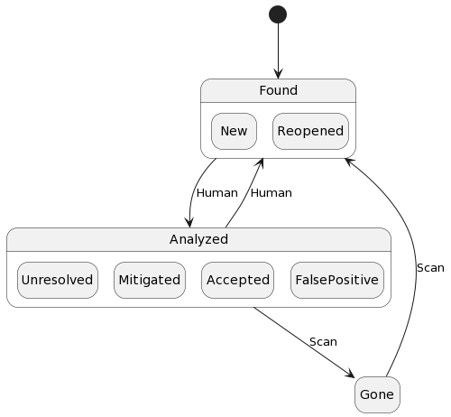

# sec-kb

## Overview

The sec-kb is a database of findings, triage, and analysis history for a set of
target projects. The key idea behind this design is that the target projects,
scan rules, and findings have properties that change or stay the same over time
and space, and by separating the unchanging properties, we can deduplicate
throughout the database and in so doing, minimize the burden of analysis,
reporting, and resolution of the findings.

For any given target project, findings change a lot over time through repeated
scans using multiple tools, human findings from penetration tests, repeated
triage of the same finding as new information emerges, and findings disappearing
due to code fixes.

The target projects change too -- they are created, deleted, and changed over
time.

## Ingester

The ingester is an API to merge scans and findings into the database.

## Tool Importer

For each scanner tool, an importer program reads scan details, findings, and
remediation advice and posts them to the ingester API. For each finding, the
importer is responsible for separating fields that do not change over time from
fields that do change. This may involve extracting a static portion of a dynamic
field (e.g. removing a hash in a URL or a session-specific nonce).

## Database

This schema is organized to avoid updating records whie retaining history over
time such that it is always possible to see the active findings and their
statuses, human comments, remediation advice, and references as of any given
date and time. This allows for a simple and familiar user interface to display
the finding and allow a person to change status, add comments, and add
references or links.

There is no need to close or delete a finding.

Deduplication is a central feature of this schema. The tool-specific importer
deduplicates findings, while the ingester deduplicates strings and text. The
pattern of referencing findings, text, and strings by ID keeps redundancy
and bloat to a minimum.

Note: I realize I have omitted severity here. This could
be another event type or the analysis event could add a severity and/or CVSS
field.

## Status

The ingester API would set status to Reopened, while a human could set it to New.

## Triage

A triage UI would display a deduplicated finding together with a history of when
it appeared, disappeared, and was analyzed including comments, status changes and
severity changes.

## Report

A report would include deduplicated findings and the latest analysis comment,
status, and severity at any specified date and time. The tool rule details such
as remediation advice and references could be included in a detailed report and
omitted in a summary report.